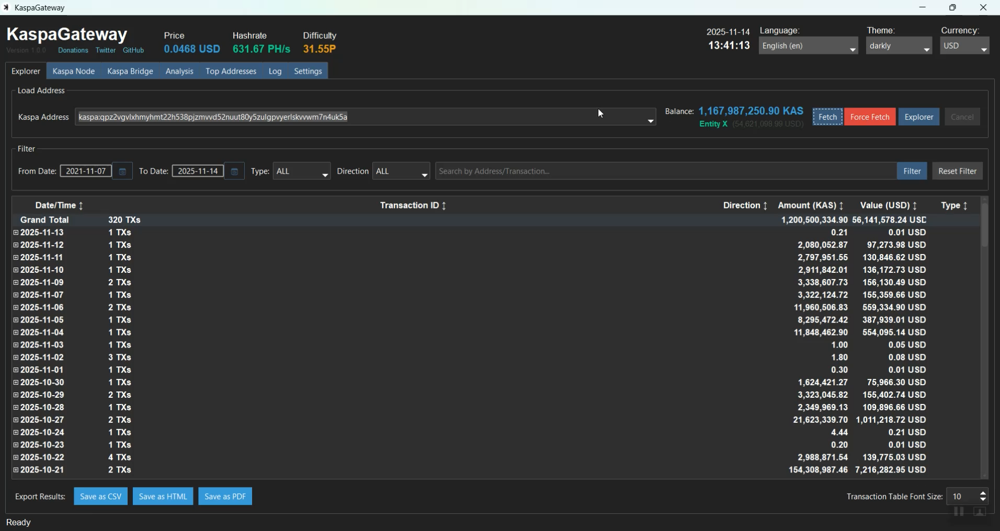

# 🌟 Kaspa Gateway

  <strong>Your Complete Kaspa Desktop: Node, Bridge & Explorer.</strong>
   
  <em>Integrated Node Management, Solo Mining Bridge, and Advanced Network Analytics.</em>

  
  
  

  

---

## 🚀 The All-in-One Kaspa Solution

Kaspa Gateway solves ecosystem fragmentation. Instead of juggling a CLI node, a separate bridge, and web explorers, Gateway combines all essential tools into one secure, intuitive desktop application.

---

## ✨ Features

* **Full Node & Bridge Control:** Run a full `kaspad` node and manage your `ks_bridge` for solo mining directly from a simple UI.
* **Advanced Analytics & Explorer:** Track network health, explore the "Rich List," and manage your addresses, all powered by a high-performance `duckdb` backend.
* **Security-First Design:** Protects your keys using the OS `keyring` and sanitizes all logs and inputs to prevent leaks or injection attacks.
* **Modern & Accessible:** A multi-language, professional UI with data export (PDF, CSV) and automatic crash recovery.

---

## ⚙️ Installation

1.  Download the **KaspaGateway_v1.0.0_Setup.exe** from the [**Latest Release**](https://github.com/KaspaPulse/KaspaGateway/releases).
2.  Run the installer.
3.  Allow the application through your Firewall to enable node syncing.

---

## 🤝 Contributing & Tech

This is a community-driven project. We welcome all contributions!

1.  Fork the Project & Create your Feature Branch.
2.  Submit a Pull Request.

* **Tech Stack:** `Python 3.10+`, `ttkbootstrap`, `pandas`, `duckdb`, `keyring`.

---

## 💖 Support the Development

**Kaspa Donation Address:** `kaspa:qz0yqq8z3twwgg7lq2mjzg6w4edqys45w2wslz7tym2tc6s84580vvx9zr44g`