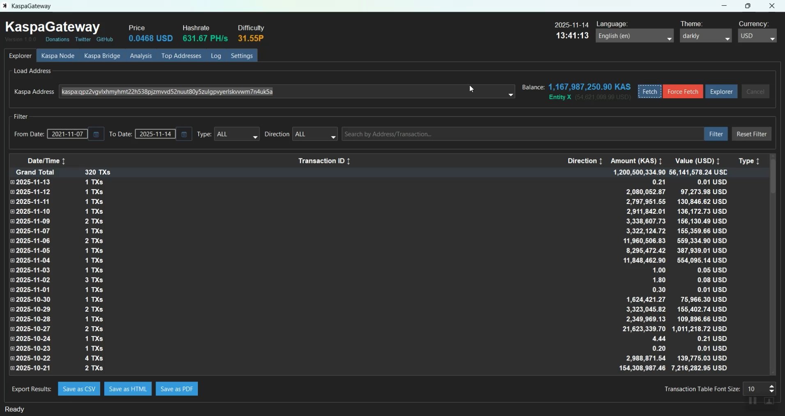

# 🌟 Kaspa Gateway

  <strong>The All-in-One Command Center for Kaspa.</strong>
   
  <em>Node Management. Solo Mining Bridge. Advanced Analytics.</em>
   
  <strong>Everything you need, wrapped in a secure and beautiful interface.</strong>

  
  
  

---

## 🚀 Why Kaspa Gateway?

**Kaspa Gateway** solves the fragmentation in the Kaspa ecosystem. Instead of running a command-line node in one window, a bridge script in another, and checking a website for prices, **Kaspa Gateway brings it all together.**

It is the first **All-in-One** desktop solution designed for both miners and investors who demand power without complexity.

---

## ✨ Key Features

### 1. 🛡️ Uncompromised Security
We take security seriously so you can run your infrastructure with peace of mind.
* **Secure Key Storage:** Securely stores API keys in the OS credential manager (e.g., Windows Credential Manager or macOS Keychain) using keyring.
* **Input Sanitization:** Built-in protection against command injection attacks to ensure safe operation.
* **Log Sanitization:** Prevents sensitive API keys from leaking into log files during error logging.
* **Binary Integrity:** Automatic SHA256 checksum verification ensures that the embedded kaspad and ks_bridge files are authentic and untampered.
* **Local Execution:** All processes run locally on your machine. Your keys and data stay with you.

### 2. 🎨 Modern Visual Experience
Say goodbye to black-and-white command prompts.
* **Professional UI:** Built with a modern, flat design (using ttkbootstrap) that is easy on the eyes.
* **Multi-Language Support:** Fully translated UI supporting over 10 languages, including Arabic, Spanish, Russian, Chinese, German, and more.
* **Rich Visualization:** Dynamic matplotlib charts for Hashrate, Difficulty, and Market trends.
* **Visual Sync Tracking:** Watch your node synchronization progress with an intuitive progress bar instead of scrolling text logs.

### 3. 📊 Deep Analytics & Address Book
* **Whale Watch:** Explore the "Rich List" to see the top addresses holding Kaspa.
* **Network Health:** Monitor real-time network stats directly from your local node or public APIs.
* **Built-in Address Book:** Save and name your frequently used addresses for easy management and access right from the UI.

### 4. 📄 Advanced Data Export
* **One-Click Reports:** Export your filtered transaction lists, counterparty analysis, or the full Rich List to multiple formats.
* **Professional Formats:** Supports export to **PDF**, **CSV** (for Excel/Sheets), and **HTML** (for web sharing).

### 5. ⛏️ The Ultimate Mining Bridge (Stratum)
* **Bridge ASICs Easily:** Connect your IceRiver or Antminer ASICs to your local node via the built-in Stratum Bridge (ks_bridge).
* **Solo Mining Made Simple:** No complex config files. Just point and click to start your solo mining journey.
* **Note:** *This is a MINING bridge for hardware communication, NOT a cross-chain bridge.*

### 6. 🖥️ Resilient Node Manager
* **One-Click Node:** Start and stop your local Kaspa node (kaspad) instantly.
* **Crash Recovery:** Intelligently detects and cleans up stale database locks (e.g., .wal files) from previous improper shutdowns.
* **Instance Locking:** Prevents multiple copies of the application from running simultaneously to protect your data.
* **Resource Monitor:** Keep track of CPU and RAM usage to ensure your PC runs smoothly.

---

## 📸 Interface Preview

  

---

## 🛠️ Tech Stack

* **Core:** Python 3.10+
* **UI Engine:** ttkbootstrap (Modern GUI)
* **Data & Plotting:** pandas, matplotlib
* **Security:** keyring, hashlib (Checksums), Input Sanitization Logic
* **Storage:** duckdb
* **Infrastructure:** Embedded kaspad & ks_bridge binaries

---

## ⚙️ Installation

1.  Download the latest release file: **KaspaGateway_v1.0.0_Setup.exe** from [**Releases**](https://github.com/KaspaPulse/KaspaGateway/releases).
2.  Run the installer.
3.  **Launch & Enjoy:** No manual script editing required. Ensure you allow the application through your Firewall so the Node can sync.

---

## 🤝 Contributing

This is a community-driven project. We welcome contributions to improve the analytics algorithms or UI design!
1.  Fork the Project.
2.  Create your Feature Branch.
3.  Submit a Pull Request.

---

## 💖 Support the Development

Building a secure, all-in-one GUI for the community takes time and resources.

**Kaspa Donation Address:**
`kaspa:qz0yqq8z3twwgg7lq2mjzg6w4edqys45w2wslz7tym2tc6s84580vvx9zr44g`

---

  Made with ❤️ for the Kaspa Community.

